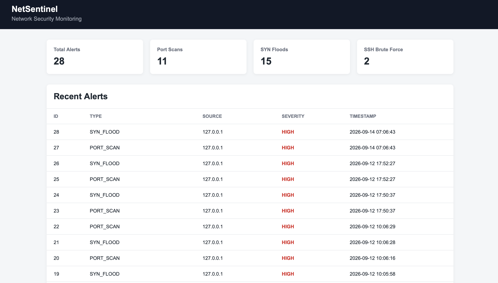

# NetSentinel


A lightweight Network Security Monitoring and Intrusion Detection System built with Python and Scapy.

NetSentinel captures and analyzes network traffic, tracks TCP connection states, detects suspicious behavior, stores security alerts in SQLite, and provides a Flask web dashboard for monitoring detected threats.

## Dashboard



## Features

* Real-time packet capture and analysis with **Scapy**
* TCP connection state tracking
* **Port scan detection**
* **SYN flood detection**
* **SSH brute-force detection**
* SSH authentication log parsing
* Persistent alert storage with **SQLite**
* REST API for retrieving alerts
* Web dashboard built with **Flask**
* Configurable detection thresholds
* Automated testing with **pytest**
* Dockerized web interface and persistence layer

## Architecture

```text
                         ┌─────────────────────┐
                         │    Network Traffic  │
                         └──────────┬──────────┘
                                    │
                                    ▼
                         ┌─────────────────────┐
                         │   Scapy Sniffer     │
                         └──────────┬──────────┘
                                    │
                                    ▼
                         ┌─────────────────────┐
                         │ Connection Tracker  │
                         │   TCP State Machine │
                         └──────────┬──────────┘
                                    │
                       ┌────────────┼────────────┐
                       ▼            ▼            ▼
                ┌────────────┐ ┌───────────┐ ┌──────────────┐
                │ Port Scan  │ │ SYN Flood │ │ SSH Brute    │
                │ Detector   │ │ Detector  │ │ Force        │
                └─────┬──────┘ └─────┬─────┘ └──────┬───────┘
                      │              │               │
                      └──────────────┼───────────────┘
                                     ▼
                            ┌─────────────────┐
                            │  Alert Manager  │
                            └────────┬────────┘
                                     │
                                     ▼
                            ┌─────────────────┐
                            │     SQLite      │
                            └────────┬────────┘
                                     │
                                     ▼
                            ┌─────────────────┐
                            │ Flask Dashboard │
                            └─────────────────┘
```

SSH authentication events follow a separate path:

```text
SSH Authentication Logs
          │
          ▼
    SSH Log Reader
          │
          ▼
 SSH_AUTH_FAILURE events
          │
          ▼
 SSH Brute-Force Detector
          │
          ▼
    Alert Manager
```

## Detection Methods

### Port Scan Detection

NetSentinel tracks TCP SYN packets originating from each source IP.

A port scan is detected when a source attempts connections to a configurable number of distinct destination ports within a defined time window.

For example:

```text
192.168.1.50 → port 21
192.168.1.50 → port 22
192.168.1.50 → port 23
192.168.1.50 → port 80
192.168.1.50 → port 443
```

A large number of distinct destination ports within a short period can indicate reconnaissance activity.

### SYN Flood Detection

NetSentinel combines two behavioral indicators:

* incoming TCP SYN rate
* number of incomplete TCP connections

An alert is generated when both measurements exceed their configured thresholds.

This provides a simple behavioral approach for identifying potentially malicious connection floods.

### SSH Brute-Force Detection

SSH authentication failures are read from system logs and converted into normalized events.

Repeated authentication failures from the same source within a configurable time window trigger an SSH brute-force alert.

Because SSH authentication is encrypted, NetSentinel relies on host-level authentication logs rather than attempting to infer password failures from network packets.

## Configuration

Detection thresholds can be configured through environment variables.

Create a local `.env` file based on `.env.example`:

```env
PORT_SCAN_TIMEFRAME=5
PORT_SCAN_THRESHOLD=5

SYN_FLOOD_TIMEFRAME=20
SYN_RATE_THRESHOLD=5
SYN_PENDING_THRESHOLD=5

DATABASE_PATH=data/netsentinel.db
```

The `.env` file is intentionally excluded from version control.

## Technologies

| Technology | Purpose                             |
| ---------- | ----------------------------------- |
| Python     | Core implementation                 |
| Scapy      | Packet capture and network analysis |
| SQLite     | Alert persistence                   |
| Flask      | Web dashboard and REST API          |
| pytest     | Automated testing                   |
| Docker     | Containerization                    |
| Git        | Version control                     |

## Project Structure

```text
netsentinel/
├── src/
│   └── netsentinel/
│       ├── __init__.py
│       ├── sniffer.py
│       ├── connection_tracker.py
│       ├── alert_manager.py
│       ├── log_reader.py
│       ├── database.py
│       ├── app.py
│       └── detectors/
│           ├── __init__.py
│           ├── port_scan.py
│           ├── syn_flood.py
│           └── ssh_bruteforce.py
├── scripts/
│   ├── ssh_manual.py
│   └── port_scan_manual.py
├── tests/
│   ├── fake_auth.log
│   └── test_*.py
├── docs/
├── Dockerfile
├── docker-compose.yml
├── pyproject.toml
├── requirements.txt
├── .env.example
├── .gitignore
└── README.md
```

## Installation

Clone the repository:

```bash
git clone https://github.com/YOUR_USERNAME/netsentinel.git
cd netsentinel
```

Create a virtual environment:

```bash
python3 -m venv .venv
source .venv/bin/activate
```

Install the project:

```bash
pip install -e .
```

## Running Locally

### Network Monitor

Packet capture generally requires elevated privileges.

Run:

```bash
sudo python src/netsentinel/sniffer.py
```

### Flask Dashboard

In a separate terminal:

```bash
python src/netsentinel/app.py
```

Then open:

```text
http://127.0.0.1:5000
```

The dashboard displays detected alerts and periodically refreshes its data through the REST API.

## Docker

The Flask dashboard and SQLite persistence layer can be run with Docker.

Build the image:

```bash
docker build -t netsentinel .
```

Run the container:

```bash
docker run --rm \
  -p 5001:5000 \
  -v netsentinel-data:/app/data \
  netsentinel
```

Then open:

```text
http://localhost:5001
```

The Docker volume preserves the SQLite database when the container is stopped or recreated.

### Docker Compose

Alternatively:

```bash
docker compose up --build
```

Then open:

```text
http://localhost:5001
```

The project uses an external Docker volume named `netsentinel-data` so that the alert database persists independently of the container lifecycle.

### Packet Capture and Docker on macOS

During development on macOS, packet capture is run directly on the host.

Docker Desktop runs Linux containers inside a virtualized environment, so containers do not automatically have access to the Mac's physical network interfaces.

The current architecture therefore separates packet capture from the containerized web and persistence components.

On Linux, the complete monitoring stack can be containerized using appropriate network configuration and packet-capture capabilities.

## API

### Get Alerts

```http
GET /api/alerts
```

Example response:

```json
[
  {
    "id": 22,
    "timestamp": 1757580000,
    "type": "PORT_SCAN",
    "source": "192.168.1.50",
    "severity": "HIGH",
    "details": {
      "ports": [21, 22, 80, 443],
      "timeframe": 5
    }
  }
]
```

## Testing

NetSentinel includes automated tests covering the main components and detection pipeline.

Run the test suite:

```bash
pytest
```

The tests cover:

* Port scan detection
* SYN flood detection
* SSH brute-force detection
* SSH log parsing
* TCP connection tracking
* SQLite database operations
* Flask API
* Dashboard rendering
* Detection pipeline integration

Manual traffic-generation scripts are available in `scripts/` for development and dashboard testing.

## Design Decisions

### SQLite

SQLite was chosen because NetSentinel is designed as a lightweight, single-node monitoring application. It requires no database server and provides sufficient persistence for the current architecture.

A server-based database such as PostgreSQL could be considered for a multi-agent deployment or significantly higher write concurrency.

### Direction-Independent TCP Connections

TCP connections are represented using both endpoints rather than simply the packet source and destination.

```text
(client IP, client port)
        ↕
(server IP, server port)
```

This allows packets belonging to the same connection to be associated even when their direction changes.

### Detector Separation

Each detection mechanism is implemented independently:

```text
Packet/Event
     ↓
Detector
     ↓
Alert
```

This allows individual detection strategies to be tested and modified without coupling them to packet capture, storage, or the dashboard.

## Limitations

NetSentinel is an educational and experimental security monitoring project rather than a production IDS.

Current limitations include:

* Detection thresholds are manually configured.
* Port-scan detection can produce false positives from legitimate applications.
* SYN-flood detection uses behavioral thresholds rather than a learned traffic baseline.
* SSH brute-force detection depends on the availability and format of system authentication logs.
* The current architecture is designed for a single monitoring node.
* macOS and Linux expose system logs differently, making SSH log collection platform-dependent.
* No machine-learning-based anomaly detection is currently implemented.

## Future Improvements

Potential future improvements include:

* Improved TCP state validation
* Additional network attack detectors
* Alert filtering and search
* Historical traffic visualizations
* Better log rotation handling
* Multi-host monitoring
* Anomaly detection using machine learning

## Disclaimer

NetSentinel is intended for **educational and authorized security testing purposes only**.

Only monitor networks and systems that you own or have explicit permission to analyze.
